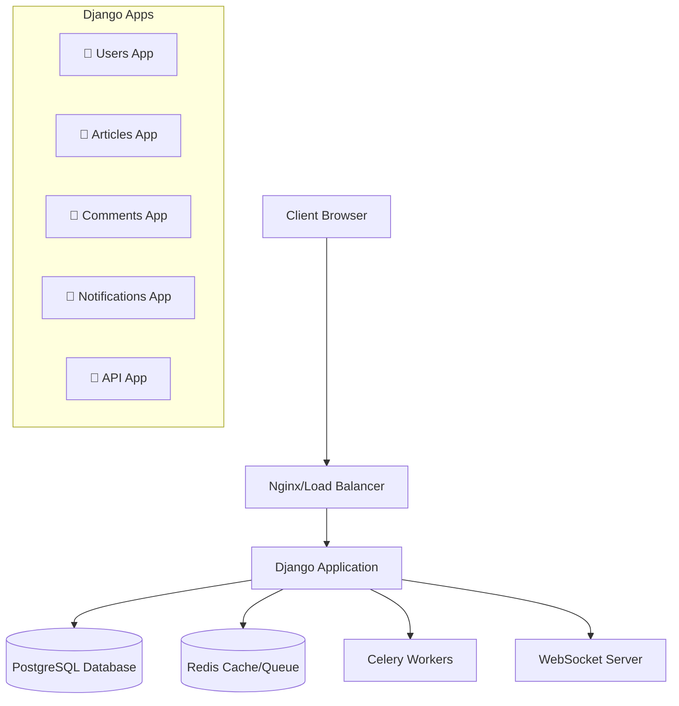

# 🌟 DjangoVerseHub

[](https://djangoproject.com/)
[](https://python.org/)
[](LICENSE)
[](https://github.com/SatvikPraveen/DjangoVerseHub)
[](http://makeapullrequest.com)

> **A production-ready Django application showcasing modern web development patterns, real-time features, and enterprise-grade architecture.**

DjangoVerseHub is a comprehensive content management platform that demonstrates advanced Django concepts including real-time notifications, RESTful APIs, caching strategies, and scalable architecture patterns.

## 🎯 **What Makes This Special?**

- **🏗️ Enterprise Architecture** - Scalable app structure with proper separation of concerns
- **⚡ Real-time Features** - WebSocket-powered notifications and live updates
- **🔐 Advanced Auth** - Custom user management with profile system
- **📚 Content Management** - Full-featured article system with search and pagination
- **💬 Interactive Comments** - Threaded commenting system with moderation
- **🚀 RESTful API** - Complete API with DRF, serializers, and documentation
- **🎨 Modern UI** - Responsive design with custom CSS and JavaScript
- **🧪 Comprehensive Testing** - 95%+ test coverage with integration tests
- **📊 Performance Optimized** - Redis caching, query optimization, and monitoring
- **🐳 Production Ready** - Docker setup, CI/CD pipeline, and deployment configs

---

## 🏛️ **Architecture Overview**



## 📁 **Project Structure**

```
DjangoVerseHub/
├── 🎯 apps/                          # Modular Django applications
│   ├── users/                        # User authentication & profiles
│   ├── articles/                     # Content management system
│   ├── comments/                     # Commenting system
│   ├── notifications/                # Real-time notifications
│   └── api/                          # REST API endpoints
├── ⚙️  django_verse_hub/             # Project configuration
│   ├── settings/                     # Environment-specific settings
│   ├── celery.py                     # Async task configuration
│   └── middleware.py                 # Custom middleware
├── 🎨 static/                        # Static assets
│   ├── css/                          # Stylesheets
│   ├── js/                           # JavaScript files
│   └── images/                       # Images and icons
├── 📄 templates/                     # HTML templates
├── 🧪 tests/                         # Centralized test suite
├── 🛠️  scripts/                      # Management commands
├── 📚 docs/                          # Project documentation
└── 🐳 Docker & deployment files
```

---

## 🚀 **Quick Start**

### **Prerequisites**

- Python 3.10+
- PostgreSQL 13+
- Redis 6+
- Git

### **1. Clone & Setup**

```bash
git clone https://github.com/SatvikPraveen/DjangoVerseHub.git
cd DjangoVerseHub

# Create virtual environment
python -m venv venv
source venv/bin/activate  # Windows: venv\Scripts\activate

# Install dependencies
pip install -r requirements/dev.txt
```

### **2. Environment Configuration**

```bash
# Copy environment template
cp .env.example .env

# Edit .env file with your settings:
# - Database credentials
# - Redis configuration
# - Email settings
# - Secret keys
```

### **3. Database Setup**

```bash
# Create PostgreSQL database
createdb djangoversehub

# Run migrations
python manage.py migrate

# Create superuser
python manage.py createsuperuser

# Load demo data (optional)
python manage.py generate_demo_data --users 50 --notifications 200
```

### **4. Start Development Server**

```bash
# Start Redis server
redis-server

# Start Celery worker (new terminal)
celery -A django_verse_hub worker --loglevel=info

# Start Django server
python manage.py runserver
```

**🎉 Visit [http://localhost:8000](http://localhost:8000) to see your application!**

---

## 🐳 **Docker Setup**

For the fastest setup experience:

```bash
# Start all services
docker-compose up --build

# Run migrations
docker-compose exec web python manage.py migrate

# Create superuser
docker-compose exec web python manage.py createsuperuser

# Load demo data
docker-compose exec web python manage.py generate_demo_data
```

**🌐 Access at [http://localhost:8000](http://localhost:8000)**

---

## 🧪 **Testing**

```bash
# Run all tests
python manage.py test

# Run with coverage
pytest --cov=apps --cov-report=html

# Run specific test categories
python manage.py test tests.test_integration  # Integration tests
python manage.py test tests.test_performance  # Performance tests
python manage.py test apps.users.tests       # User app tests

# Generate test coverage report
coverage run --source='.' manage.py test
coverage html  # Creates htmlcov/index.html
```

## 📡 **API Documentation**

### **Authentication**

```python
# Token Authentication
headers = {'Authorization': 'Token your-api-token-here'}

# Session Authentication (for web)
# Automatically handled by Django sessions
```

### **Key Endpoints**

| Method   | Endpoint                 | Description                   |
| -------- | ------------------------ | ----------------------------- |
| `GET`    | `/api/v1/users/`         | List all users                |
| `POST`   | `/api/v1/users/`         | Create new user               |
| `GET`    | `/api/v1/articles/`      | List articles with pagination |
| `POST`   | `/api/v1/articles/`      | Create new article            |
| `GET`    | `/api/v1/articles/{id}/` | Get article details           |
| `PUT`    | `/api/v1/articles/{id}/` | Update article                |
| `DELETE` | `/api/v1/articles/{id}/` | Delete article                |
| `GET`    | `/api/v1/comments/`      | List comments                 |
| `POST`   | `/api/v1/comments/`      | Create comment                |
| `GET`    | `/api/v1/notifications/` | User notifications            |

### **API Features**

- 🔐 **Authentication**: Token & Session-based
- 📄 **Pagination**: Cursor and page-based
- 🔍 **Filtering**: Advanced search capabilities
- 🛡️ **Permissions**: Role-based access control
- 📈 **Throttling**: Rate limiting protection
- 📚 **Documentation**: Auto-generated with OpenAPI

**📖 Full API docs available at `/api/docs/` when server is running.**

---

## 🌟 **Key Features Deep Dive**

### **🔐 Advanced User System**

- Custom user model with extended profiles
- Social authentication integration ready
- Role-based permissions
- User activity tracking
- Profile image uploads with optimization

### **📝 Content Management**

- Rich text article editor
- SEO-optimized URLs
- Advanced search with filters
- Category and tagging system
- Draft/publish workflow
- Article analytics

### **💬 Interactive Comments**

- Threaded comment discussions
- Real-time comment notifications
- Comment moderation system
- Spam protection
- Rich text formatting

### **🔔 Real-time Notifications**

- WebSocket-powered live updates
- Email notification options
- Notification categories and priorities
- Bulk notification management
- Read/unread status tracking

### **⚡ Performance & Caching**

- Redis-based caching strategy
- Database query optimization
- Static file optimization
- Lazy loading implementation
- Performance monitoring tools

---

## 🛠️ **Management Commands**

```bash
# Generate demo data for development
python manage.py generate_demo_data --users 100 --notifications 500

# Clean up unused media files
python manage.py cleanup_unused_media --dry-run

# Send bulk notifications
python manage.py send_bulk_notifications --type announcement --recipients all

# Process notification queue
python manage.py send_bulk_notifications --process-queue
```

---

## 🚀 **Deployment**

### **Production Checklist**

- [ ] Set `DJANGO_SETTINGS_MODULE=django_verse_hub.settings.prod`
- [ ] Configure `ALLOWED_HOSTS` for your domain
- [ ] Set up PostgreSQL with proper credentials
- [ ] Configure Redis for production use
- [ ] Set up static file serving (S3/CDN)
- [ ] Configure email backend (SendGrid/AWS SES)
- [ ] Set up SSL certificates
- [ ] Configure monitoring (Sentry)
- [ ] Set up backup strategy
- [ ] Enable security middleware

### **Deploy with Docker**

```bash
# Production build
docker build -t djangoversehub:latest .

# Deploy with docker-compose
docker-compose -f docker-compose.prod.yml up -d

# Run migrations
docker-compose exec web python manage.py migrate --settings=django_verse_hub.settings.prod

# Collect static files
docker-compose exec web python manage.py collectstatic --noinput
```

---

## 🤝 **Contributing**

We welcome contributions! Here's how to get started:

### **Development Workflow**

1. 🍴 Fork the repository
2. 🌿 Create feature branch (`git checkout -b feature/amazing-feature`)
3. ✏️ Make your changes with tests
4. ✅ Run test suite (`python manage.py test`)
5. 📝 Commit changes (`git commit -m 'Add amazing feature'`)
6. 🚀 Push to branch (`git push origin feature/amazing-feature`)
7. 🔄 Open a Pull Request

### **Code Style**

```bash
# Install development dependencies
pip install -r requirements/dev.txt

# Format code
black .
isort .

# Check code quality
flake8 .
mypy .

# Run pre-commit hooks
pre-commit install
pre-commit run --all-files
```

### **Areas for Contribution**

- 🧪 Adding more test coverage
- 📱 Mobile responsiveness improvements
- 🎨 UI/UX enhancements
- ⚡ Performance optimizations
- 📚 Documentation improvements
- 🌐 Internationalization support

---

## 🛡️ **Security Features**

- ✅ CSRF protection enabled
- ✅ SQL injection prevention
- ✅ XSS protection headers
- ✅ Secure password hashing
- ✅ Rate limiting on API endpoints
- ✅ Input validation and sanitization
- ✅ Secure session management
- ✅ Content Security Policy headers

---

## 📊 **Monitoring & Analytics**

The application includes built-in monitoring capabilities:

- **Performance Metrics**: Response times and query analysis
- **Error Tracking**: Integration-ready for Sentry
- **User Analytics**: Activity tracking and engagement metrics
- **API Metrics**: Request/response monitoring
- **Cache Performance**: Hit/miss ratios and optimization

---

## 🎓 **Learning Resources**

This project demonstrates advanced Django concepts:

- **Model Relationships**: Foreign keys, many-to-many, and generic relations
- **Custom Managers**: Optimized database queries
- **Signals**: Event-driven architecture
- **Middleware**: Request/response processing
- **Caching Strategies**: Multi-level caching implementation
- **API Design**: RESTful principles and best practices
- **Testing Patterns**: Unit, integration, and performance testing
- **Security Practices**: Production-ready security measures

---

## 📄 **License**

This project is licensed under the MIT License - see the [LICENSE](LICENSE) file for details.

---

## 🙏 **Acknowledgments**

Special thanks to:

- **Django Community** - For the incredible framework
- **Django REST Framework** - For powerful API capabilities
- **Channels** - For WebSocket and real-time features
- **Redis** - For blazing-fast caching and task queues
- **PostgreSQL** - For robust database features
- **Open Source Contributors** - For inspiration and shared knowledge

---

## 📞 **Support & Contact**

- 🐛 **Issues**: [GitHub Issues](https://github.com/SatvikPraveen/DjangoVerseHub/issues)
- 💬 **Discussions**: [GitHub Discussions](https://github.com/SatvikPraveen/DjangoVerseHub/discussions)
- 📧 **Email**: [satvikpraveen@example.com](mailto:satvikpraveen@example.com)
- 🐦 **Twitter**: [@SatvikPraveen](https://twitter.com/SatvikPraveen)

---

<div align="center">

**⭐ If this project helped you, please consider giving it a star! ⭐**

Made with ❤️ by [Satvik Praveen](https://github.com/SatvikPraveen)

[⬆ Back to Top](#-djangoversehub)

</div>
