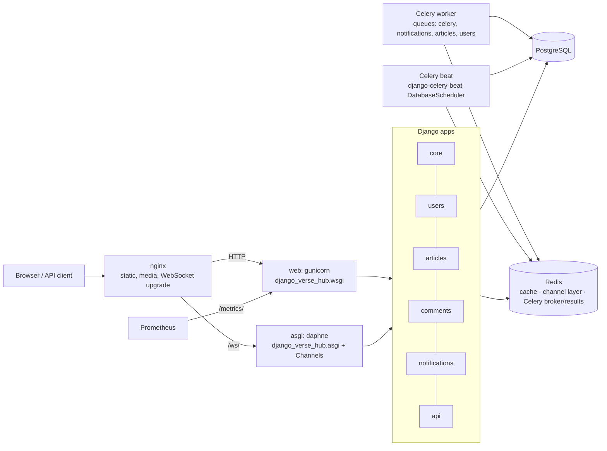

# DjangoVerseHub

[](https://github.com/SatvikPraveen/DjangoVerseHub/actions/workflows/ci.yml)
[](https://www.djangoproject.com/)
[](https://www.python.org/)
[](LICENSE)
[](https://github.com/SatvikPraveen/DjangoVerseHub)

DjangoVerseHub is a content-and-community platform written as a learning codebase for Django 4.2: Markdown articles with revision history and feeds, threaded comments with moderation, a follow graph, in-app and real-time notifications, and a versioned REST API. It runs on the full production toolchain (PostgreSQL, Redis, Celery worker and beat, Channels over ASGI, nginx, Prometheus metrics) and ships with a 680-test suite, a CI pipeline and multi-stage Docker images. If you want to see how a particular Django, DRF, Channels or Celery idea is used here, start with [docs/concept-index.md](docs/concept-index.md).

## Features

**Core (`apps/core`)**
- Home page with featured, latest and popular articles (query results cached for two minutes).
- Global search across articles, people and tags (`/search/`), plus sitemap.xml and robots.txt.
- Informational pages (getting started, guidelines, FAQ, API, privacy, terms, cookies).
- Contact and feedback forms with a honeypot field, stored as `ContactMessage` rows with admin actions.
- Double opt-in newsletter (`NewsletterSubscriber`, confirmation email sent by a Celery task, tokenised unsubscribe).
- `SiteSetting` key/value store; public settings are exposed to every template through a context processor and cached.
- Markdown rendering sanitised with nh3 (`apps/core/markdown.py`, `{{ text|markdown }}` and `{{ text|markdown_text:200 }}` filters) with separate allow-lists for articles and comments and output cached by content hash.
- Template tags in `apps/core/templatetags/core_tags.py` (`update_query`, `initials`, `active_if`, `humanize_count`, `badge`, `json_ld`, `markdown`, `markdown_text`).
- Domain-event signals that feed Prometheus counters (sign-ups, published articles, comments, notifications).
- Management commands: `generate_demo_data`, `cleanup_unused_media`, `send_bulk_notifications` (see [Management commands](#management-commands)).

**Users (`apps/users`)**
- `CustomUser` with a UUID primary key and email as the login field (username still required and unique).
- Login with either email or username; sign-up, settings and password-change pages; POST-only logout.
- Email verification with signed, expiring links (3 days) and a resend action limited to once per 10 minutes.
- Password reset by email with signed tokens that stop working as soon as the password changes.
- Data export (`/users/export/`, JSON attachment) and account deletion (`/users/delete/`, password required): accounts with published articles are anonymised so the articles stay attributed to a "deleted user"; others are hard-deleted.
- `Profile` (one per user, created by signal) with avatar/cover resizing via Pillow, privacy flags and notification switches.
- `Follow` model with database constraints against duplicates and self-follows; follow/unfollow views, following page, leaderboard, activity feed.
- DRF `UserViewSet` (`me` with GET/PATCH/DELETE, `me/export`, `register`, `login`, `logout`, `change-password`, `follow`, `unfollow`, `followers`, `following`) and `ProfileViewSet` (`search`, `stats`, `me` alias).
- django-allauth is installed under `/accounts/` (email login, mandatory email verification by default, Google and GitHub providers configured).

**Articles (`apps/articles`)**
- `Article` (UUID pk, slug, draft/published/archived, featured flag, SEO fields), `Category`, `Tag`, `Bookmark`, `ArticleLike`, `ArticleRevision`.
- Every change to title/content/summary snapshots an `ArticleRevision`; revisions page and one-click restore.
- Draft visibility rules: published articles are public, drafts and archived articles are visible only to the author and staff.
- View counting deduplicated per session/IP for one hour; like counter maintained atomically with `F()` expressions.
- Search uses PostgreSQL full-text search (`SearchVector`/`SearchRank`) when the database is PostgreSQL and falls back to `icontains` elsewhere.
- RSS 2.0 and Atom feeds for the latest articles and per category, tag and author (`/articles/feed/...`), advertised from `base.html`.
- schema.org `BlogPosting` JSON-LD on article pages (``) and ETag-based conditional GET for anonymous readers.
- Trending, popular and featured listings; bookmarks and "my articles"/drafts pages; autocomplete endpoint.

**Comments (`apps/comments`)**
- Generic threaded `Comment` attached to any model with a UUID primary key (`GenericForeignKey`), depth limited to 3 levels.
- `CommentLike` with atomic counters, `CommentFlag` reports that mark a comment flagged after 3 distinct reporters (staff flags apply immediately).
- 15-minute edit window for authors, soft delete with `[removed]` placeholders for deleted comments that still have replies.
- `` inclusion tag renders a whole thread in two queries.
- Auto-moderation heuristics (spam patterns, shouting) run as a Celery task on every new comment.
- DRF `CommentViewSet` with a per-user creation throttle, `like`, `flag`, `stats`, `tree` and `user_comments` actions.

**Notifications (`apps/notifications`)**
- `Notification` (like, comment, follow, mention, post, system) created through `notify()`, which skips the actor, de-duplicates unread notifications and honours per-user preferences.
- `NotificationPreference` per user: in-app and email switches per type, immediate/daily/weekly digest.
- Real-time delivery over WebSockets via Django Channels (`/ws/notifications/`) with a dependency-free JS client.
- Daily and weekly digest emails and a cleanup task, scheduled with Celery beat.
- Preferences page and API, list page with filters, "mark all read".

**API (`apps/api`)**
- Versioned under `/api/v1/`; root, health, stats, search, trending and dashboard endpoints.
- Token auth, JWT (djangorestframework-simplejwt with rotation and blacklist) and session auth.
- OpenAPI 3 schema at `/api/v1/schema/`, Swagger UI at `/api/v1/docs/`, ReDoc at `/api/v1/redoc/` (drf-spectacular).
- Uniform error envelope `{"error": {"code", "message", "details?", "request_id"}}` on every error response.

**Platform (`django_verse_hub/`)**
- Settings split into `base`, `dev`, `prod`, `test` and `ci`, configured from the environment with python-decouple. Redis is optional in development: with `REDIS_URL` empty the dev settings use a local-memory cache, an in-memory channel layer and run Celery tasks inline.
- Middleware: `RequestIDMiddleware` (accepts or mints `X-Request-ID`, echoes it, injects it into every log line), `RequestLoggingMiddleware`, `RateLimitMiddleware`, `SecurityHeadersMiddleware` (Content-Security-Policy built from settings, `Permissions-Policy`, `Cross-Origin-Opener-Policy`, `X-Frame-Options`, `Referrer-Policy`), plus django-prometheus request/database metrics.
- Health probes at `/health/live/` and `/health/ready/` (database, cache, Celery broker); Prometheus exposition at `/metrics/` (bearer `METRICS_TOKEN` or a staff session).
- Celery app with beat schedule (django-celery-beat `DatabaseScheduler`), Channels ASGI application, WhiteNoise static files, optional Sentry and S3 in production.

## Architecture


```mermaid
graph LR
    Client[Browser / API client] --> Nginx[nginx<br/>static, media, WebSocket upgrade]
    Nginx -->|HTTP| Web[web: gunicorn<br/>django_verse_hub.wsgi]
    Nginx -->|/ws/| ASGI[asgi: daphne<br/>django_verse_hub.asgi + Channels]
    Web --> Apps
    ASGI --> Apps
    subgraph Apps[Django apps]
        core --- users --- articles --- comments --- notifications --- api
    end
    Apps --> PG[(PostgreSQL)]
    Apps --> Redis[(Redis<br/>cache · channel layer · Celery broker/results)]
    Worker[Celery worker<br/>queues: celery, notifications, articles, users] --> Redis
    Worker --> PG
    Beat[Celery beat<br/>django-celery-beat DatabaseScheduler] --> Redis
    Beat --> PG
    Prom[Prometheus] -->|/metrics/| Web
```

- **web** serves HTTP through gunicorn (WSGI). **asgi** serves the same Django project through daphne and additionally handles WebSocket connections. nginx routes `/ws/` to the ASGI process and everything else to the WSGI process.
- Notifications are pushed from ordinary request code to the WebSocket consumer through the channel layer (`apps/notifications/signals.py`): Redis when `REDIS_URL` is set, otherwise Channels' in-memory layer (single process only).
- Celery tasks are routed by module to the `notifications`, `articles` and `users` queues (`CELERY_TASK_ROUTES`); beat stores its schedule in PostgreSQL so it can be edited in the admin.

## Project structure

```
DjangoVerseHub/
├── apps/
│   ├── api/             # root/health/stats/search/trending/dashboard views, auth views, routers,
│   │                    # exception handler (error envelope), throttles, permissions, pagination
│   ├── articles/        # models (Article, Category, Tag, Bookmark, ArticleLike, ArticleRevision),
│   │                    # managers, search, cache, feeds, forms, tasks, signals, web views + DRF viewsets,
│   │                    # templatetags/article_tags.py (JSON-LD)
│   ├── comments/        # generic threaded Comment, CommentLike, CommentFlag, moderation, forms,
│   │                    # templatetags/comment_tags.py, tasks, signals, views + viewset
│   ├── core/            # home, search, info pages, contact/feedback, newsletter, SiteSetting, markdown.py,
│   │                    # context_processors, sitemaps, signals (metrics), templatetags/core_tags.py,
│   │                    # management/commands
│   ├── notifications/   # Notification, NotificationPreference, consumers.py, routing.py,
│   │                    # signals (fan-out + WebSocket push), tasks (digests, cleanup), views
│   └── users/           # CustomUser, Profile, Follow, managers, forms, serializers, tasks, views,
│                        # utils.py (signed tokens, export, anonymisation)
│   (each app also has admin.py, migrations/, templates/<app>/ and tests/)
├── django_verse_hub/
│   ├── settings/        # base.py, dev.py, prod.py, test.py, ci.py
│   ├── asgi.py          # ProtocolTypeRouter: HTTP + WebSocket under /ws/
│   ├── celery.py        # Celery app and beat schedule
│   ├── health.py        # liveness / readiness probes
│   ├── metrics.py       # /metrics/ view and application counters
│   ├── middleware.py    # RequestID, RequestLogging, RateLimit, SecurityHeaders (CSP)
│   ├── permissions.py   # shared DRF permissions and CBV mixins
│   ├── urls.py · wsgi.py · utils.py
├── templates/           # base.html, includes/ (navbar, footer, cached fragments), emails/, errors/
├── static/              # css/, js/ (api.js, main.js, notifications.js, cache-sw.js), images/, manifest.json
├── tests/               # conftest.py + cross-app suites: infrastructure, hardening, integration,
│                        # performance, urls, settings
├── requirements/        # base.txt, dev.txt, test.txt, prod.txt
├── docs/                # setup-guide.md, api-docs.md, concept-index.md, architecture/ER diagrams (SVG)
├── nginx/nginx.conf     # reverse proxy used by the compose stacks
├── scripts/docker-entrypoint.sh
├── .github/workflows/ci.yml
├── Dockerfile · docker-compose.yml · docker-compose.prod.yml
├── Makefile · pyproject.toml · .pre-commit-config.yaml · .env.example · pyrightconfig.json
├── generate_djangoverse_structure.sh   # the original scaffold generator (historical)
└── manage.py
```

## Quick start

### Prerequisites

- Python 3.10, 3.11 or 3.12
- PostgreSQL (the dev settings use PostgreSQL; only the test settings use SQLite)
- Redis, optional for local development (see below); required for multi-process deployments
- Docker with Compose v2 if you prefer the container route

### Local (virtualenv + Makefile)

```bash
git clone https://github.com/SatvikPraveen/DjangoVerseHub.git
cd DjangoVerseHub
make venv                     # python3 -m venv .venv && pip install -r requirements/dev.txt
cp .env.example .env          # set SECRET_KEY and the DB_* values for your PostgreSQL
createdb djangoversehub       # or create the database/user named in .env
make migrate
make superuser
make demo                     # optional: python manage.py generate_demo_data
make run                      # http://localhost:8000
```

`.env.example` points `REDIS_URL` at a local Redis. If you do not have Redis, set `REDIS_URL=` (empty): the dev settings then use a local-memory cache and an in-memory channel layer and execute Celery tasks inline (`CELERY_TASK_ALWAYS_EAGER` defaults to `True` when `REDIS_URL` is empty), so sign-up emails, notifications and moderation still work in a single process.

`make run` starts Django's `runserver`, which in this project is Daphne's ASGI server (the `daphne` app is first in `INSTALLED_APPS` for `dev.py`), so WebSocket notifications work locally out of the box. Serving through daphne directly is equivalent:

```bash
DJANGO_SETTINGS_MODULE=django_verse_hub.settings.dev \
  .venv/bin/daphne -b 0.0.0.0 -p 8000 django_verse_hub.asgi:application
```

With Redis available, run background jobs in separate terminals with `make worker` and `make beat`. `make help` lists every target (`test`, `coverage`, `lint`, `format`, `typecheck`, `check`, `shell`, `docker-up`, ...).

### Docker Compose

```bash
cp .env.example .env
make docker-up                # docker compose up --build
```

The development stack (`docker-compose.yml`) starts:

| Service  | What it runs                                                   | Port |
| -------- | -------------------------------------------------------------- | ---- |
| `db`     | postgres:15-alpine                                             | 5432 |
| `redis`  | redis:7-alpine                                                 | 6379 |
| `web`    | `migrate` then `runserver` (source mounted, hot reload)        | 8000 |
| `asgi`   | `daphne django_verse_hub.asgi:application`                     | 8001 |
| `worker` | Celery worker on the `celery,notifications,articles,users` queues | – |
| `beat`   | Celery beat with the database scheduler                        | –    |
| `nginx`  | only with `--profile proxy`; routes `/ws/` to `asgi`, the rest to `web` | 80 |

Open http://localhost:8000. For WebSockets through a single origin start the proxy profile (`docker compose --profile proxy up --build`) and open http://localhost/. Then:

```bash
docker compose exec web python manage.py createsuperuser
docker compose exec web python manage.py generate_demo_data --admin
```

## Configuration

All settings come from environment variables (or a `.env` file) read with python-decouple. `.env.example` lists the common ones; the full set read by the settings modules:

| Variable | Default | Used by |
| --- | --- | --- |
| `DJANGO_SETTINGS_MODULE` | `django_verse_hub.settings.dev` | which settings module to load |
| `SECRET_KEY` | insecure placeholder | must be set in production |
| `DEBUG` | `False` (dev.py forces `True`) | base.py |
| `ALLOWED_HOSTS` | `` (dev.py: localhost) | required in prod; also validates WebSocket origins |
| `CSRF_TRUSTED_ORIGINS` | `` | base.py |
| `SITE_NAME`, `SITE_TAGLINE`, `SITE_URL` | DjangoVerseHub / Connect, Learn, Build / http://localhost:8000 | templates, absolute links in emails and feeds |
| `APP_VERSION` | `1.1.0` | health payload, API schema, Sentry release |
| `DB_NAME`, `DB_USER`, `DB_PASSWORD`, `DB_HOST`, `DB_PORT` | djangoversehub / django_user / django_password / localhost / 5432 | PostgreSQL connection |
| `REDIS_URL` | `` | when set: Redis channel layer (all settings) and Redis cache (dev, ci); when empty: in-memory channel layer, and dev uses a local-memory cache. Required by prod.py |
| `CELERY_BROKER_URL`, `CELERY_RESULT_BACKEND` | `redis://localhost:6379/2`, `/3` | dev.py defaults; required in prod |
| `CELERY_TASK_ALWAYS_EAGER` | `True` when `REDIS_URL` is empty, else `False` | dev.py; run tasks inline without a worker |
| `EMAIL_HOST`, `EMAIL_PORT`, `EMAIL_USE_TLS`, `EMAIL_HOST_USER`, `EMAIL_HOST_PASSWORD`, `DEFAULT_FROM_EMAIL` | localhost / 587 / True / "" / "" / noreply@djangoversehub.com | SMTP backend (dev.py prints emails to the console) |
| `ACCOUNT_EMAIL_VERIFICATION` | `mandatory` | allauth |
| `JWT_ACCESS_MINUTES`, `JWT_REFRESH_DAYS` | `30`, `14` | simplejwt lifetimes |
| `RATE_LIMIT_ENABLED`, `RATE_LIMIT_REQUESTS_PER_MINUTE` | `True`, `100` | `RateLimitMiddleware` (skipped when `DEBUG`) |
| `SLOW_REQUEST_THRESHOLD_MS` | `1000` | `RequestLoggingMiddleware` warning threshold |
| `LOG_LEVEL`, `LOG_FORMAT`, `LOG_DIR` | `INFO`, `verbose`, `/var/log/djangoversehub` | logging (`LOG_FORMAT=json` for JSON lines; prod.py always uses JSON) |
| `SQL_LOG_LEVEL` | `INFO` | dev.py; set `DEBUG` to log SQL |
| `CSP_ENABLED`, `CSP_REPORT_ONLY`, `CSP_REPORT_URI` | `True`, `False`, `` | `SecurityHeadersMiddleware` (not listed in `.env.example`) |
| `METRICS_TOKEN` | `` | bearer token for `/metrics/`; when empty a staff session is required (not listed in `.env.example`) |
| `SECURE_SSL_REDIRECT`, `SECURE_HSTS_SECONDS` | `True`, `31536000` | prod.py |
| `CORS_ALLOWED_ORIGINS` | `` | prod.py (dev allows all origins) |
| `USE_S3` + `AWS_ACCESS_KEY_ID`, `AWS_SECRET_ACCESS_KEY`, `AWS_STORAGE_BUCKET_NAME`, `AWS_S3_REGION_NAME` | `False` | prod.py media storage on S3 |
| `SENTRY_DSN`, `SENTRY_ENVIRONMENT`, `SENTRY_TRACES_SAMPLE_RATE`, `SENTRY_PROFILES_SAMPLE_RATE` | "" / production / 0.1 / 0.0 | prod.py |
| `KEEP_MIGRATIONS` | `0` | test settings: run the real migration graph instead of syncing models |

Google/GitHub social login credentials are not read from the environment: allauth expects them as `SocialApp` rows created in the admin. `ADMIN_URL` is read by `prod.py` but the URLconf mounts the admin at `/admin/` regardless.

## Tests, lint and type-check

```bash
make test        # python -m pytest -q  (682 tests, SQLite in-memory, migrations disabled, Celery eager)
make test-fast   # pytest -n auto (pytest-xdist)
make coverage    # pytest --cov, terminal + htmlcov/; fail_under = 70 in pyproject.toml
make lint        # ruff check .
make format      # ruff format . && ruff check --fix .
make typecheck   # mypy apps django_verse_hub (configured, currently reports errors; not run in CI)
make check       # python manage.py check + makemigrations --check (migration drift)
make ci          # lint + check + test, the same steps CI runs
pre-commit install
```

The last measured coverage is 79% of `apps/` and `django_verse_hub/` (migrations, tests and settings excluded). CI (`.github/workflows/ci.yml`) runs ruff, the test suite on Python 3.10/3.11/3.12 with SQLite, a second run against PostgreSQL 15 + Redis 7 with real migrations (`settings/ci.py`), and a build of the production Docker target.

## API overview

Base path: `/api/v1/`. Interactive documentation: Swagger UI at `/api/v1/docs/`, ReDoc at `/api/v1/redoc/`, raw OpenAPI 3 schema at `/api/v1/schema/`. Full endpoint reference: [docs/api-docs.md](docs/api-docs.md).

**Authentication**

| Method | How to obtain | Header |
| --- | --- | --- |
| DRF token | `POST /api/v1/auth/token/` with `{"username": "<email>", "password": ...}` or `POST /api/v1/auth/login/` with `{"email", "password"}` | `Authorization: Token <key>` |
| JWT | `POST /api/v1/auth/jwt/create/` with `{"email", "password"}` → `access` + `refresh`; `refresh/` rotates and blacklists the old refresh token; `verify/`, `blacklist/` | `Authorization: Bearer <access>` |
| Session | log in through the website | cookie + `X-CSRFToken` |

JWT, DRF token and session authentication are accepted uniformly on every endpoint; anonymous requests to protected routes get 401 with the error envelope below.

**Error envelope** (every non-2xx response, `request_id` matches the `X-Request-ID` response header):

```json
{
  "error": {
    "code": "validation_error",
    "message": "Invalid input.",
    "details": {"title": ["Title must be at least 5 characters long."]},
    "request_id": "7f4c0d0e9a3b4b7c9c1d2e3f4a5b6c7d"
  }
}
```

**Examples**

```bash
# Obtain a JWT pair
curl -s -X POST http://localhost:8000/api/v1/auth/jwt/create/ \
  -H 'Content-Type: application/json' \
  -d '{"email": "you@example.com", "password": "secret"}'

# Search published articles, most viewed first (public)
curl -s 'http://localhost:8000/api/v1/articles/?search=django&ordering=-views_count'

# Like an article with a DRF token
curl -s -X POST http://localhost:8000/api/v1/articles/<article-uuid>/like/ \
  -H 'Authorization: Token <key>'

# Nested comment thread for an article
curl -s 'http://localhost:8000/api/v1/comments/tree/?content_type=articles.article&object_id=<article-uuid>'

# Export your own data
curl -s -H 'Authorization: Token <key>' http://localhost:8000/api/v1/users/me/export/ -o export.json
```

## Real-time notifications

- Route: `apps/notifications/routing.py` registers `ws/notifications/`, and `django_verse_hub/asgi.py` mounts the Channels router under `ws/`, so the WebSocket URL is `ws(s)://<host>/ws/notifications/`.
- The ASGI stack is `AllowedHostsOriginValidator(AuthMiddlewareStack(URLRouter(...)))`: the browser's `Origin` must match `ALLOWED_HOSTS`, and the session cookie authenticates the socket. Anonymous connections are closed immediately.
- `NotificationConsumer` (`apps/notifications/consumers.py`) adds each socket to the group `user_<id>`. Client messages: `{"action": "mark_read", "notification_id": n}`, `{"action": "mark_all_read"}`, `{"action": "get_unread_count"}`, `{"action": "ping"}`. Server messages: `notification`, `unread_count`, `notification_read`, `all_read`, `pong`, `error`.
- Delivery: `notify()` in `apps/notifications/signals.py` creates notifications and calls `channel_layer.group_send` (via `async_to_sync`), so a like, comment, follow or published article reaches an open browser tab immediately. The channel layer is Redis when `REDIS_URL` is set and Channels' in-memory layer otherwise (fine for a single daphne process, not across processes).
- Client: `static/js/notifications.js` connects automatically when the navbar bell is present, reconnects with exponential backoff, updates the badge/title/dropdown, shows toasts, and falls back to the JSON endpoints under `/notifications/api/` when the socket is closed.
- Requires an ASGI server: daphne in production, or `runserver` in development (ASGI-enabled). If no socket is available the client keeps retrying harmlessly and the HTTP fallbacks still work.

## Background jobs

`django_verse_hub/celery.py` defines the beat schedule; django-celery-beat's `DatabaseScheduler` stores it in PostgreSQL, so entries can be inspected and edited under Periodic Tasks in the admin.

| Beat entry | Task | Interval | Effect |
| --- | --- | --- | --- |
| `send-daily-digest` | `apps.notifications.tasks.send_daily_digest` | every 24 h | emails users on the daily digest with their unread notifications of the last 24 h |
| `cleanup-old-notifications` | `apps.notifications.tasks.cleanup_old_notifications` | every hour | deletes read notifications older than 90 days |
| `send-weekly-digest` | `apps.notifications.tasks.send_weekly_digest` | every 7 days | weekly digest of the last 7 days |
| `cleanup-unused-media` | `apps.articles.tasks.cleanup_unused_media` | every 7 days | placeholder: logs the number of referenced images and returns 0 |

Event-driven tasks (enqueued from signals and views): welcome, verification and password-reset emails (`apps/users/tasks.py`), comment/reply/like emails and auto-moderation (`apps/comments/tasks.py`), immediate notification emails and WebSocket pushes (`apps/notifications/tasks.py`), featured-image processing (`apps/articles/tasks.py`), newsletter confirmation (`apps/core/tasks.py`). Tasks are routed to the `notifications`, `articles` and `users` queues; the entrypoint's worker consumes `celery,notifications,articles,users`.

## Observability

- `X-Request-ID` is accepted from upstream (nginx forwards its own) or generated, echoed on every response, included in every log record and in API error envelopes.
- `RequestLoggingMiddleware` logs one structured line per request (method, path, status, duration, user id, client IP) and warns above `SLOW_REQUEST_THRESHOLD_MS`. `LOG_FORMAT=json` switches to JSON lines; production always logs JSON to stdout and to a rotating file under `LOG_DIR`.
- `/metrics/` exposes Prometheus metrics: django-prometheus request, response and database metrics plus application counters from `django_verse_hub/metrics.py` incremented by the signal receivers in `apps/core/signals.py` (`djangoversehub_users_registered_total`, `djangoversehub_articles_published_total`, `djangoversehub_comments_created_total`, `djangoversehub_notifications_created_total{notification_type}`; the `djangoversehub_websocket_connections` gauge is declared but not yet updated by the consumer). Access requires `Authorization: Bearer <METRICS_TOKEN>` or, when no token is configured, a logged-in staff session.
- `/health/live/`, `/health/ready/` (alias `/health/`) and `/api/v1/health/` report liveness and dependency readiness; Sentry is enabled in production when `SENTRY_DSN` is set.

## Management commands

```bash
python manage.py generate_demo_data [--users 25] [--articles 80] [--comments 300] [--seed N] [--clear] [--admin]
python manage.py cleanup_unused_media [--dry-run] [--older-than 30] [--stats-only] [--file-types jpg png ...] [--interactive]
python manage.py send_bulk_notifications --type announcement --title ... --message ... [--recipients all|active|staff|group] [--dry-run]
```

`generate_demo_data` creates interlinked users (password `demo-password-123`, emails under `demo.djangoversehub.local`), categories, tags, articles, follows, likes, bookmarks and comments; notifications are produced by the normal signal handlers. `--clear` removes previously generated demo data. `send_bulk_notifications` sends system announcements to all, active, staff or group members (or from a CSV) with `--dry-run` support.

## Deployment

- Use `DJANGO_SETTINGS_MODULE=django_verse_hub.settings.prod` with `SECRET_KEY`, `ALLOWED_HOSTS`, `DB_*`, `REDIS_URL`, `CELERY_BROKER_URL` and `CELERY_RESULT_BACKEND` set. `prod.py` turns on `sslmode=require`, HSTS, secure cookies, `SECURE_PROXY_SSL_HEADER`, sessions in the Redis cache, WhiteNoise manifest static files, JSON logs to stdout plus a rotating file under `LOG_DIR`, optional Sentry and optional S3 media.
- **Image**: `Dockerfile` has `development` and `production` targets. The production image builds wheels in a `builder` stage, runs as a non-root `app` user, runs `collectstatic` at build time and declares a `HEALTHCHECK` on `/health/live/`.
- **Entrypoint** (`scripts/docker-entrypoint.sh`): `web` (wait for DB, migrate, gunicorn on `$PORT`, `GUNICORN_WORKERS`, `GUNICORN_TIMEOUT`), `asgi` (migrate, daphne), `worker` (`CELERY_QUEUES`, `CELERY_CONCURRENCY`, `CELERY_LOG_LEVEL`), `beat`, `migrate`, or any other command.
- **Stack**: `docker compose -f docker-compose.prod.yml up -d --build` runs `db`, `redis`, `web`, `asgi` (port 8001 internally), `worker`, `beat` and `nginx` on port 80 with the config in `nginx/nginx.conf` (static/media served by nginx, `/ws/` upgraded to `asgi`, `X-Request-ID` forwarded).
- **Probes**: `/health/live/` returns `{"status": "ok"}` when the process is up; `/health/ready/` (alias `/health/`) checks the database, cache and Celery broker and returns 503 with per-check details when degraded. `/api/v1/health/` wraps the same probe. Point Prometheus at `/metrics/` with `METRICS_TOKEN`.
- TLS termination is not part of the repository; put a certificate-terminating proxy in front of nginx or extend `nginx/nginx.conf`.

## Known limitations

- `make typecheck` (mypy with django-stubs) is configured but does not pass yet; CI does not run it.
- The in-memory channel layer and cache used when `REDIS_URL` is empty only work within a single process; set `REDIS_URL` for anything multi-process.
- Full-text search uses PostgreSQL's `SearchVector` when available and falls back to `icontains` on SQLite.
- Social login providers are configured as `SocialApp` rows in the admin; no provider is preconfigured.

## Contributing

1. Fork and create a branch (`git checkout -b feat/short-description`).
2. `make venv && pre-commit install`.
3. Add or update tests next to the code you change (`apps/<app>/tests/` or `tests/`).
4. Run `make ci` (ruff, Django checks, migration drift check, pytest) before pushing.
5. Open a pull request; CI runs the same steps plus the PostgreSQL job and the Docker build.

Commit messages follow the `type(scope): summary` style used in the history (`feat(users): ...`, `fix(models): ...`).

## License

MIT. See [LICENSE](LICENSE).
